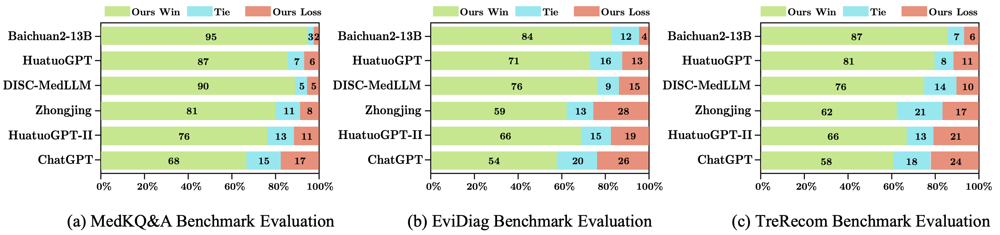

# [NeurIPS 2024] PediatricsGPT: Large Language Models as Chinese Medical Assistants for Pediatric Applications

We release PediatricsGPT, the first Chinese medical large language model for pediatric applications and medical generalist:

<p align="center">
  
</p>

> [**PediatricsGPT: Large Language Models as Chinese Medical Assistants for Pediatric Applications**](https://arxiv.org/pdf/2405.19266)        
>  Dingkang Yang\*<sup>1</sup>, Jinjie Wei\*<sup>1</sup>, Dongling Xiao\*<sup>2</sup>,..., Ke Li<sup>3</sup>, Peng Zhai<sup>1</sup>, Lihua Zhang<sup>1</sup> <br>
>  <sup>1</sup>Academy for Engineering and Technology, Fudan University <br>
>  <sup>2</sup>ByteDance <br>
>  <sup>3</sup>Tencent Youtu Lab <br>


## Abstract

Developing intelligent pediatric consultation systems offers promising prospects for improving diagnostic efficiency, especially in China, where healthcare resources are scarce.
Despite recent advances in Large Language Models (LLMs) for Chinese medicine, their performance is sub-optimal in pediatric applications due to inadequate instruction data and vulnerable training procedures. To address the above issues, this paper builds PedCorpus, a high-quality dataset of over 300,000 multi-task instructions from pediatric textbooks, guidelines, and knowledge graph resources to fulfil diverse diagnostic demands.
Upon well-designed PedCorpus, we propose PediatricsGPT, the first Chinese pediatric LLM assistant built on a systematic and robust training pipeline.
In the continuous pre-training phase, we introduce a hybrid instruction pre-training mechanism to mitigate the internal-injected knowledge inconsistency of LLMs for medical domain adaptation.
Immediately, the full-parameter Supervised Fine-Tuning (SFT) is utilized to incorporate the general medical knowledge schema into the models.
After that, we devise a direct following preference optimization to enhance the generation of pediatrician-like humanistic responses.
In the parameter-efficient secondary SFT phase, a mixture of universal-specific experts strategy is presented to resolve the competency conflict between medical generalist and pediatric expertise mastery. Extensive results based on the metrics, GPT-4, and doctor evaluations on distinct downstream tasks show that PediatricsGPT consistently outperforms previous Chinese medical LLMs.

## PedCorpus

To endow the model with versatile diagnostic proficiency, PedCorpus is constructed through the multi-dimensional corpus across three application-oriented medical tasks, including Knowledge Question-Answer (MedKQ\&A), Evidence-based Diagnosis (EviDiag), and Treatment Recommendation (TreRecom). After undergoing an internal ethical review by the partnering healthcare institutions, we release licensed and controllable portions of data resources from [PedCorpus](https://huggingface.co/datasets/joejoe123/PedCorpus).

## PediatricsGPT


> After going through the designed training procedure, we provide the 13B version of the model after the DFPO phase as well as the MoE-Adapter from the parameter-efficient secondary SFT phase.<br>

| Model            | Link                                                                                           | Description                        |
|-----------------|------------------------------------------------------------------------------------------------|----------------------------|
| PediatricsGPT-13B-Base | [Access](https://huggingface.co/joejoe123/PediatricsGPT-13B/tree/main/PediatricsGPT-base) | Preference-aligned version via the direct following preference optimization |
| MoE-Adapter | [Access](https://huggingface.co/joejoe123/PediatricsGPT-13B/tree/main/MoE-Adapter) | LoRA-based Adapter with mixture of universal-specific experts  |

## Deploy
```sh
git clone https://github.com/ydk122024/PediatricsGPT.git
cd PediatricsGPT
pip install -r requirements.txt
```
Client-side Inference:
```sh
CUDA_VISIBLE_DEVICES=$num python src/cli_demo.py \                 
--model_name_or_path $model_dir \
--adapter_name_or_path $adapter_dir \
--template default \
--finetuning_type lora
```
Web-side Inference:
```sh
CUDA_VISIBLE_DEVICES=$num python src/web_demo.py \                 
--model_name_or_path $model_dir \
--adapter_name_or_path $adapter_dir \
--template default \
--finetuning_type lora
```
## Result Analysis
We present the comparison results of different models on three medical benchmarks through multifaceted metrics, including ROUGE-1/2/L, BLEU-1/2/3/4, GLEU, and Distinct-1/2. 

Measuring model performance from multiple aspects is essential in the medical domain. To this end, we consider four dimensions to holistically assess response
quality, including usefulness, correctness, consistency, and smoothness. Advanced GPT-4 is prompted to select the winning response between pairwise models based on these dimensions.

Doctor approval of LLM assistants is a vital step toward realistic applications. We invite several doctors to determine the winner of pairwise models by the majority voting rule. The evaluation requires simultaneous consideration of the responses’ professionalism, factuality, and safety.


## Limitations Statement
The user should assume all medical risks and responsibilities in the use of the model. Model responses should be treated with caution due to the possibility of hallucinations.

## Acknowledgement
We are aware that our works are inspired by the following works, including but not limited to
* LLaMA-Factory: [https://github.com/hiyouga/LLaMA-Factory](https://github.com/hiyouga/LLaMA-Factory)
* Baichuan: [https://huggingface.co/baichuan-inc](https://huggingface.co/baichuan-inc)

Without these, nothing could happen in this repository.

## Citation
If you are using our PediatricsGPT for your research, please cite the following paper:
 ```bibtex
@inproceedings{yang2024pediatricsgpt,
 title={PediatricsGPT: Large Language Models as Chinese Medical Assistants for Pediatric Applications},
  author={Yang, Dingkang and Wei, Jinjie and Xiao, Dongling and Wang, Shunli and Wu, Tong and Li, Gang and Li, Mingcheng and Wang, Shuaibing and Chen, Jiawei and Jiang, Yue and others},
  booktitle={Thirty-eighth Conference on Neural Information Processing Systems (NeurIPS)},
  year={2024}
}
```
